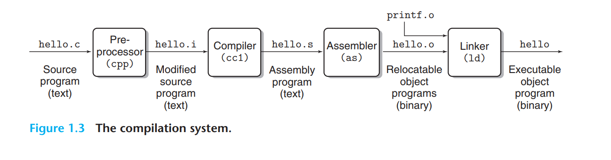

# How to Read the Book


```
Whenever you learn something new, you can try it out right away and see the result firsthand.

	In fact, we believe that the only way to learn systems is to do systems, either working concrete problems
	or writing and running programs on real systems
	
	
#### When a new concept is introduced, it
	is followed in the text by one or more practice problems that you should work immediately to test your 		understanding. Solutions to the practice problems are at the end of each chapter. As you read, try to solve each problem on your own and then check the solution to make sure you are on the right track
```


# Book Overview

1. ​	 A Tour of Computer Systems( 计算机系统概述) 

   - This chapter introduces the major ideas and themes in computer systems by tracing the life cycle of a simple “hello, world” program.

2. : Representing and Manipulating Information. （表示和操纵信息） 

   ```
   我们涵盖了计算机算术，强调了影响程序员的无符号和二进制补码数表示的特性。我们考虑数字如何表示，因此可以为给定的字长编码多少值范围。我们考虑有符号数字和无符号数字之间的强制转换的效果。我们介绍了算术运算的数学性质。新手程序员经常惊讶地发现 （2'scomplement） 和或两个正数的乘积可以是负数。另一方面，二进制补码算术满足整数算术的许多代数性质，因此编译器可以安全地将常数乘法转换为移位和加法序列。我们使用 C 的位级运算来演示布尔代数的原理和应用。我们将介绍 IEEE 浮点格式如何表示值和浮点运算的数学属性。对计算机算术有扎实的理解对于编写可靠的程序至关重要。例如，由于可能溢出，程序员和编译器不能将表达式 （x<y） 替换为 （x-y < 0）。他们甚至不能用表达式 （-y < -x） 替换它，因为 2 的补码表示中负数和正数的范围不对称。算术溢出是编程错误和安全漏洞的常见来源，但很少有其他书籍从程序员的角度介绍计算机算术的特性。
   ```

3. Machine-Level Representation of Programs （程序的机器级表示）

   ​	

   ```
   我们教您如何阅读 C 编译器生成的 x86-64 机器代码。我们介绍了为不同的控制结构生成的基本指令模式，例如条件语句、循环和 switch 语句。我们介绍了过程的实现，包括堆栈分配、寄存器使用约定和参数传递。我们介绍了不同数据结构（如结构、联合和数组）的分配和访问方式。我们介绍了实现整数和浮点运算的指令。我们还使用程序的机器级视图作为了解常见代码安全漏洞（如缓冲区溢出）和程序的编译器和操作系统可以采取措施来减少这些威胁。学习本章中的概念有助于您成为更好的程序员，因为您将了解程序在计算机上的表示方式。一个确定的好处是您将对指针有深入而具体的了解
   ```

   

4. Processor Architecture（处理器架构）

   ```
   本章介绍基本的组合和顺序 logic elements，然后展示如何将这些 elements 组合到一个数据路径中，该数据路径执行 x86-64 指令集的简化子集，称为 “Y86-64”。我们从单周期 datapath 的设计开始。此设计在概念上非常简单，但不会很快。然后，我们介绍了流水线，其中处理指令所需的不同步骤作为单独的阶段实现。在任何给定时间，每个阶段都可以处理不同的指令。我们的五级处理器管道要现实得多。处理器设计的控制逻辑使用一种称为 HCL 的简单硬件描述语言进行描述。用 HCL 编写的硬件设计可以编译并链接到教科书提供的仿真器中，并且它们可用于生成适合综合到工作硬件中的 Verilog 描述
   ```

   

5. Optimizing Program Performance （优化程序性能）

   ```
   介绍了许多提高代码性能的技术，其理念是程序员学习编写 C 代码，以便编译器可以生成高效的机器代码。我们从减少程序要完成的工作的转换开始，因此在为任何机器编写任何程序时，都应该成为标准做法。然后，我们进行转换，以提高生成的机器代码中指令级并行度的程度，从而提高它们在现代 “超标量” 处理器上的性能。为了激励这些转换，我们引入了一个关于现代乱序处理器如何工作的简单操作模型，并展示了如何通过程序的图形表示来衡量程序的关键路径方面的潜在性能。您会惊讶地发现，通过 C 代码的简单转换可以大大加快程序的速度。
   ```

   

6. The Memory Hierarchy（内存层次结构）

   ```
   内存系统是应用程序程序员在计算机系统中最明显的部分之一。到目前为止，您依赖于内存系统的概念模型，即具有统一访问时间的线性阵列。在实践中，内存系统是具有不同容量、成本和访问时间的存储设备的层次结构。我们介绍了不同类型的 RAM 和 ROM 存储器，以及磁盘和固态驱动器的几何结构和组织。我们描述了这些存储设备是如何在层次结构中排列的。我们展示了这种层次结构是如何通过引用位置实现的。我们通过引入一种独特的记忆系统观点来使这些想法具体化，即具有时间局部性的山脊和空间局部性的斜坡。最后，我们将向您展示如何通过改进应用程序的时态和空间局部性来提高应用程序的性能
   ```

   

7.  Linking 

   ```
   本章介绍静态链接和动态链接，包括可重定位和可执行目标文件、符号解析、重定位、静态库、共享目标库、与位置无关的代码和库插入的概念。大多数系统文本中没有涵盖链接，但我们涵盖它有两个原因。首先，程序员可能遇到的一些最令人困惑的错误与链接过程中的毛刺有关，尤其是对于大型软件包。其次，链接器生成的对象文件与加载、虚拟内存和内存映射等概念相关联。
   ```

   

8. Exceptional Control Flow(卓越的控制流) 

   ```
   在演示的这一部分，我们通过引入异常控制流的一般概念（即控制流中超出正常分支和过程调用的更改）来超越单个程序模型。我们涵盖了存在于系统各个级别的异常控制流的示例，从低级硬件异常和中断，到并发进程之间的上下文切换，到由接收 Linux 信号引起的控制流突然变化，再到 C 语言中打破堆栈规则的非本地跳转。这是本书中介绍流程的基本概念的部分，即执行程序的抽象。您将了解流程的工作原理以及如何从应用程序创建和操作流程。我们将展示应用程序程序员如何通过 Linux 系统调用来利用多个进程。完成本章后，您将能够编写一个带有作业控制的简单 Linux shell。这也是您第一次介绍并发程序执行时出现的不确定性行为。
   ```

   

9. Virtual Memory(虚拟内存)

   ​	

   ```
   我们对虚拟内存系统的介绍旨在让您对它的工作原理和特性有所了解。我们希望您了解不同的同步进程如何各自使用相同的地址范围，共享一些页面，但拥有其他页面的单独副本。我们还介绍了管理和操作虚拟内存所涉及的问题。特别是，我们介绍了 storage allocators 的操作，例如 standard-library malloc 和 free 操作。Cov- 前言 25 引用此材料有几个目的。它强化了虚拟内存空间只是一个字节数组的概念，程序可以将其细分为不同的存储单元。它可以帮助您了解包含内存引用错误（如存储泄漏和无效指针引用）的程序的影响。最后，许多应用程序程序员编写自己的存储分配器，这些分配器针对应用程序的需求和特征进行了优化。本章比其他任何一章都更能展示以统一方式涵盖计算机系统的硬件和软件方面的好处。传统的计算机体系结构和操作系统文本只是虚拟内存故事的一部分
   ```

   

10. System-Level I/O 

    ```
    我们介绍了 Unix I/O 的基本概念，例如文件和描述符。我们介绍了如何共享文件、I/O 重定向的工作原理以及如何访问文件元数据。我们还开发了一个健壮的缓冲 I/O 包，它可以正确处理一种称为短计数的奇怪行为，其中库函数仅读取部分输入数据。我们介绍了 C 标准 I/O 库及其与 Linux I/O 的关系，重点介绍了标准 I/O 的限制，这些限制使其不适合网络编程。通常，本章中涵盖的主题是接下来两章关于网络和并发程序的构建块
    ```

    

11. Network Programming

    ```
    网络是有趣的 I/O 设备，可以编程，它将我们在本文前面学习的许多概念（例如进程、信号、字节排序、内存映射和动态存储分配）联系在一起。网络程序还为并发提供了令人信服的上下文，这是下一章的主题。本章是网络编程的薄片，可让您编写一个简单的 Web 服务器。我们涵盖了所有网络应用程序的基础客户端-服务器模型。我们展示了程序员对 Internet 的看法，并展示了如何使用 sockets 接口编写 Internet 客户端和服务器。最后，我们介绍 HTTP 并开发一个简单的迭代 Web 服务器。
    ```

    

12. : Concurrent Programming 

    ```
    本章介绍使用 Internet 服务器设计作为运行激励示例的并发编程。我们比较和对比了编写并发程序的三种基本机制 — 进程、I/O 多路复用和线程 — 并展示了如何使用它们来构建并发 Internet 服务器。我们介绍了使用 P 和 V 信号量操作进行同步的基本原则、线程安全和重入性、争用条件和死锁。编写并发代码对于大多数服务器应用程序来说是必不可少的。我们还介绍了如何使用线程级编程在应用程序中表达并行性，从而在多核处理器上实现更快的执行。让所有内核都处理单个计算问题需要仔细协调并发线程，这既是为了正确性，也是为了实现高性能。
    ```


# A Tour of Computer System

​	

```c
#include <stdio.h>

int main() {
    printf("Hello, World!\n");
    return 0;
}
```

## 1.1 Information Is Bits + Context

The representation of hello.c illustrates a fundamental idea: All information in a system—including disk files, programs stored in memory, user data stored in memory, and data transferred across a network—is represented as a bunch of bits. The only thing that distinguishes different data objects is the context in which we view them. For example, in different contexts, the same sequence of bytes might represent an integer, floating-point number, character string, or machine instruction

**作为程序员，我们需要了解数字的机器表示，因为它们与整数和实数不同。它们是有限近似值，可以以意想不到的方式运行**。第 2 章详细探讨了这一基本概念。

## 1.2 Programs Are Translated by Other Programs into Different Forms




​		    gcc -o hello hello.c

​		从源文件编译为exe文件历经四个阶段：

​	**preprocessor, compiler, assembler, and linker**

- ​	**Preprocessing phase.**  The preprocessor (cpp) modifies the original C program according to directives that begin with the ‘#’ character. For example, the #include  command in line 1 of hello.c tells the preprocessor to read the contents of the system header file stdio.h and insert it directly into the program text. The result is another C program, typically with the .i suffix.

  ​	预处理，处理# 链接文件，后缀为.i

- **Compilation phase.**  The compiler (cc1) translates the text file hello.i into the text file hello.s, which contains an assembly-language program

  ​			

  ```assembly
  main:
  	subq $8, %rsp
      movl $.LC0, %edi
      call puts
      movl $0, %eax
      addq $8, %rsp
      ret
  ```

  Each of lines 2–7 in this definition describes one low-level machinelanguage instruction in a textual form. Assembly language is useful because it provides a common output language for different compilers for different high-level languages. For example, C compilers and Fortran compilers both generate output files in the same assembly language.

-  **Assembly phase.**.the assembler (as) translates hello.s into machinelanguage instructions, packages them in a form known as a relocatable object program, and stores the result in the object file hello.o. This file is a binary file containing 17 bytes to encode the instructions for function main. If we were to view hello.o with a text editor, it would appear to be gibberish.

- **. Linking phase **Notice that our hello program calls the printf function, which is part of the standard C library provided by every C compiler. The printf function resides in a separate precompiled object file called printf.o, which must somehow be merged with our hello.o program. The linker (ld) handles this merging. The result is the hello file, which is an executable object file (or simply executable) that is ready to be loaded into memory and executed by the system.
     #不同的库，分离出来，linker(ld) 负责合并这些.o文件，最终link为 exe文件


​		hello world  汇编

```assembly
; nasm -f elf -o write.o write.S
 ; ld -m elf_i386 -s -o write.bin write.o
;
section .data
    hello db 'Hello, World!' , 0x0A ; 定义字符串 "Hello, World!" 并在末尾添加换行符

section .text
    global _main

_main:
    ; 写消息到 stdout
    mov eax, 4          ; 'write' 系统调用的编号是 4
    mov ebx, 1          ; 文件描述符 1 表示 stdout
    mov ecx, hello      ; 将字符串的地址放入 ecx
    mov edx, 13         ; 字符串的长度是 13
    int 0x80            ; 触发系统调用

    ; 退出程序
    mov eax, 1          ; 'exit' 系统调用的编号是 1
    xor ebx, ebx        ; 退出码 0
    int 0x80            ; 触发系统调用


```


## 1.3 It Pays to Understand How Compilation Systems Work

there are some important reasons why programmers need to understand how compilation systems work:

- ​	**Optimizing program performance.**  Modern compilers are sophisticated tools that usually produce good code. As programmers, we do not need to know the inner workings of the compiler in order to write efficient code. However, in order to make good coding decisions in our C programs, we do need a basic understanding of machine-level code and how the compiler translates different C statements into machine code.
- **Understanding link-time errors.** In our experience, some of the most perplexing programming errors are related to the operation of the linker, especially when you are trying to build large software systems. 
- **Avoiding security holes.**  For many years, buffer overflow vulnerabilities have accounted for many of the security holes in network and Internet servers. These vulnerabilities exist because too few programmers understand the need to carefully restrict the quantity and forms of data they accept from untrusted sources. A first step in learning secure programming is to understand the consequences of the way data and control information are stored on the program stack.

## 1.4 Processors Read and Interpret Instructions Stored in Memory

